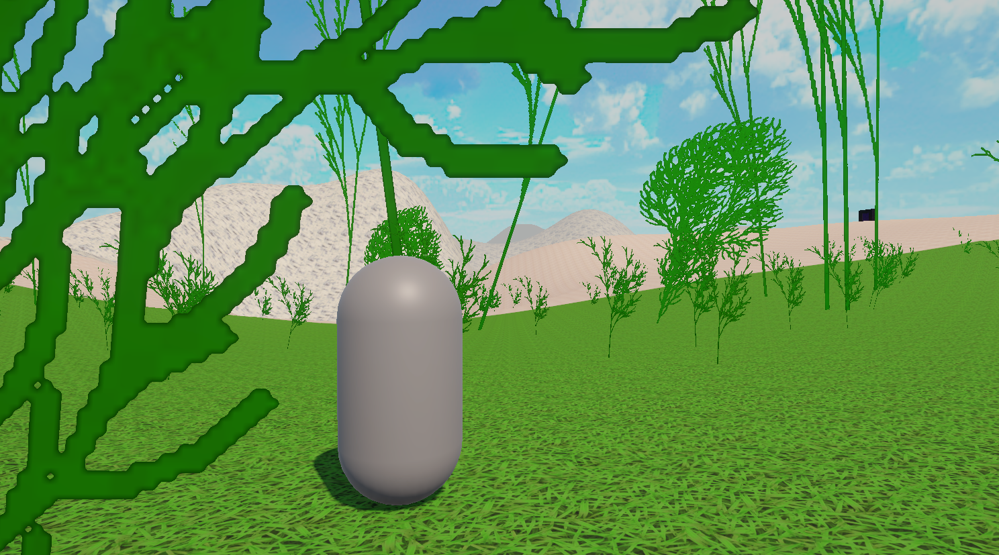
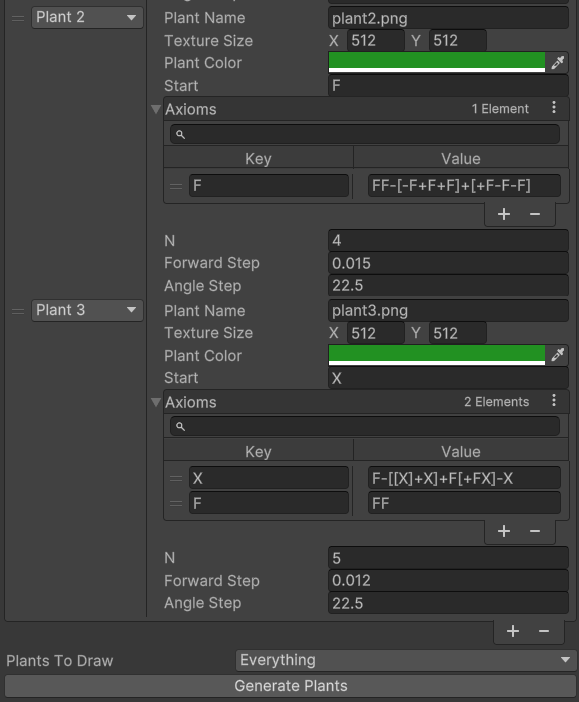
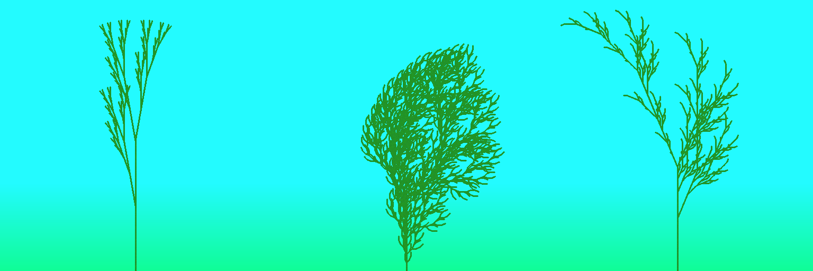
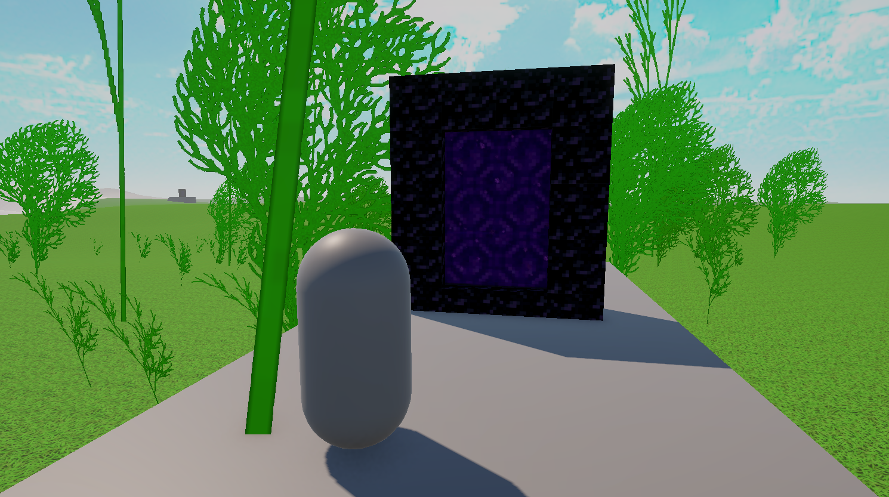
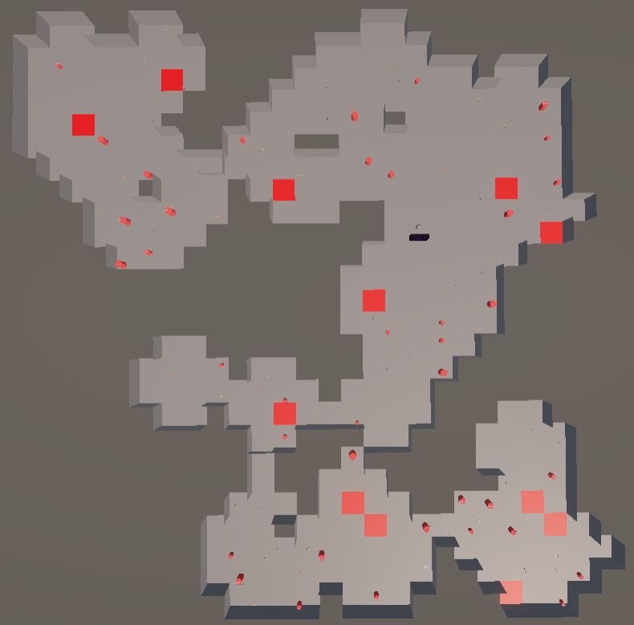
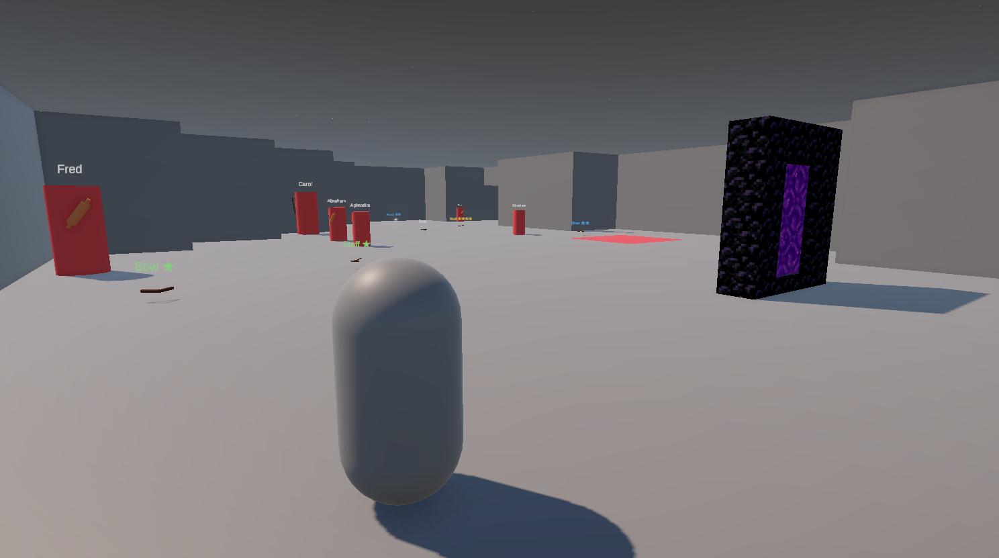
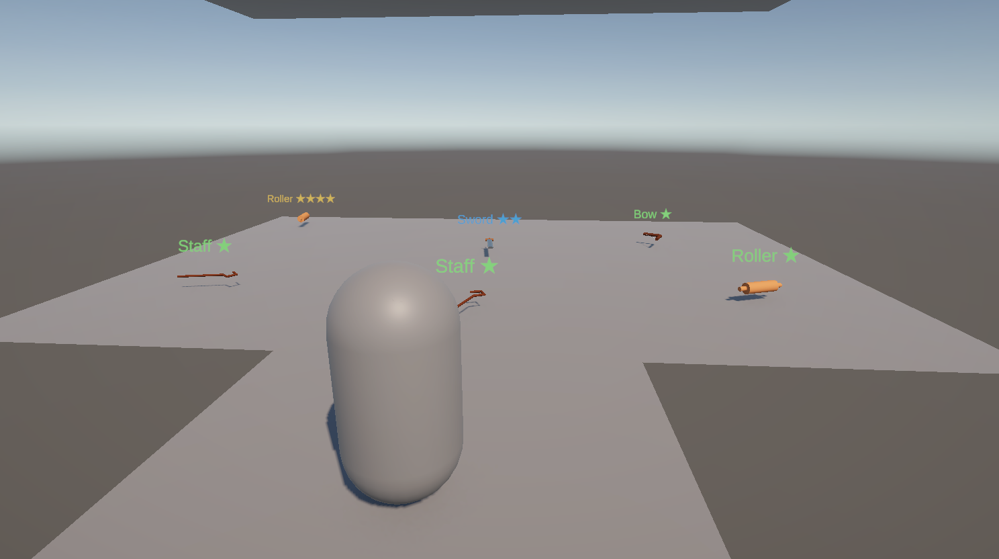
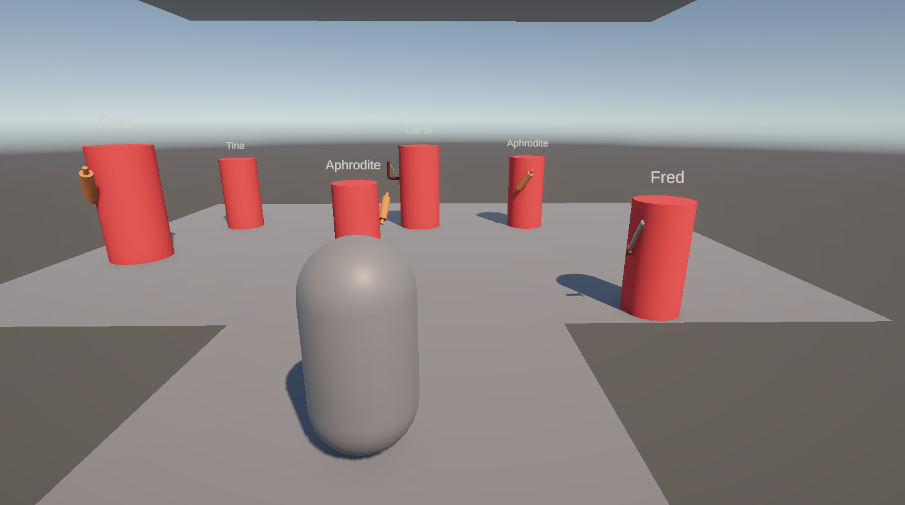

# 🏞️️ Procedural Generation
This is a Unity 6.0 project created for the Procedural Generation course. Its primary goal is to demonstrate different procedural generation techniques, which will all be explained in detail throughout the rest of the documentation.

In summary, these techniques include procedural generation of:
 * **Terrain**, using Perlin noise
 * **Biomes**, using Simplex noise
 * **Vegetation**, using L-systems
 * **Dungeons**, using Cellular Automata
 * **NPCs and Items**, using regular randomization

<!-- Insert a gif of the game here -->


## 🌍 General
First and foremost, it is important to mention that the entire world generation is consistent, given a seed. The seed, set in the Unity inspector, determines the terrain's heightmap, the dungeon entrances' placement and their respective dungeon's seed, which then determines the exact generation of the dungeon. Vegetation varies based on the given seed, to make the world feel a bit more dynamic.

## ⛰️ Terrain
As mentioned before, terrain generation uses Perlin noise as its base. The seed determines a random offset in the Simplex noise map, which is then used to sample positions for the heightmap. The terrain is divided into 64x64 chunks, to allow for infinite terrain generation and dynamic loading and unloading.

### Heightmap Generation
The terrain is generated using a formula that takes in a set of 2D coordinates and samples a specific position from a Perlin noise map. The organic-looking terrain comes from the use of Perlin noise, while the randomness comes from a random offset used to sample the noise. The terrain is highly malleable thanks to the many parameters that define the sampling formula:
 * **Octaves**, the number of samples for one position
 * **Scale**, determines how rapidly the terrain changes
 * **Amplitude**, determines how big the difference in altitude can be
 * **Frequency**, similar to the scale
 * **Persistence**, determines the altitude contribution of future octaves
 * **Lacunarity**, determines the frequency contribution of future octaves

If we apply this formula for each position in the terrain's heightmap (which is done per-chunk in a separate thread), we obtain the final terrain shape.

### Chunk Loading
The chunk loading system uses a multi-threaded approach, in order to make the gameplay feel smoother, and to make the loading as natural as possible.

When the game starts, there are no loaded chunks. In Awake(), a coroutine is started, which runs every frame and checks for new chunks to be loaded. These chunks are placed in a queue by a separate thread, whenever the data is ready to be instantiated. At the beginning, the chunk queue is empty.

In the Update() method, the loader checks whether the player has moved to a new chunk, and also runs on the first Update call. When this event occurs, the following sequence of events takes place:
 * the *chunk generation task*, if it was previously running, is **cancelled**
 * the chunk creation queue is cleared, to avoid duplicating chunks
 * chunks that are too far away from the player are destroyed
   * a chunk is too far away is the Manhattan distance to the player is larger than the render distance
 * the chunk generation task is started on a separate thread

The parallel task has a single job: to create new chunks and to add them to the queue when they are done. It goes through all the chunks within the render distance, in a certain order: increasingly bigger diamond-shaped rings around the player. A chunk is created only if it does not exist in a HashSet of loaded chunks.

It is worth mentioning that Unity does not allow Unity-specific operations on threads other than the main one, which led to the usage of a concurrent queue. This is where the coroutine started in Awake comes into play: the generation task simply created the terrain data for the chunk, as a float matrix. Each frame, the coroutine checks for new chunks in the queue, takes the next one, Instantiates the chunk, sets the terrain data, and populates the chunk with details (vegetation).

The coroutine generates at most **one** chunk per frame, so as to not keep the game frozen for too long.

### Biome Generation
Biomes are regions on the terrain which correspond to certain climatic factors. In this project, each biome holds data associated with the terrain generation for that region (the formula parameters mentioned above), along with an index for the corresponding terrain layer.

Currently, there are **four** biomes, based on two climatic factors: **temperature** and **rainfall**. These can be seen in the table below. 

<table>
<tr>
   <td></td> <th>Arid</th> <th>Rainy</th>
</tr>
<tr>
   <th>Cold</th> <td>Hills</td> <td>Tundra</td>
</tr>
<tr>
   <th>Warm</th> <td>Desert</td> <td>Plains</td>
</tr>
</table>

Similarly to the terrain generation formula, the temperature and rainfall values are also extracted using an almost identical formula, just with fewer parameters, and using Simplex noise instead of Perlin. For each terrain tile in a chunk, the **t** and **r** values are computed by sampling noise with a random, seed-based offset (one for each factor). Their values will be within the `[0, 1]` interval, so rounding them will get us the biome that most closely resembles the newly obtained temperature and rainfall values. However, simply choosing the closest match creates discontinuities at biome borders, due to the difference in the sampled noise map.

In order to avoid abrupt changes in terrain heights at biome borders, we need some way to blend between the terrain parameters. This can be done by interpolating between the biomes horizontally in pairs, by the temperature factor, and then interpolating between the resulting biomes vertically, by the rainfall factor. Interpolating between biomes simply refers to interpolating between each defining floating point feature, such as amplitude, frequency etc.

This, however, is still not enough. A simple interpolation would not make the distinctions between biomes too visible. To combat this, we can define a more 'abrupt' interpolation formula, that only blends the terrain right next to the border:

```csharp
const float aMax = 0.45f, bMin = 0.55f;
if (t < aMax) return a;
if (t > bMin) return b;
return Mathf.Lerp(a, b, (t - aMax) / (bMin - aMax));
```


## 🌿 Vegetation
Vegetation, in short, is represented as detail layers in Unity's Terrain functionality. They are billboarded textures, implicitly deformed by Unity to create a wind effect. The important procedural generation functionality uses L-systems to create the plant textures.

### Generation
The PlantGenerator MonoBehaviour provides an Inspector button (thanks to the NaughtyAttributes package) that starts the texture generation of the selected plants. Each plant is created as an L-system, with the following attributes:
 * **Start**, the starting symbol of the grammar
 * **Axioms**, a dictionary of rules that define the grammar
 * **N**, the maximum expansion depth of the grammar
 * **Forward Step**, the distance the cursor travels forward, in the virtual `[0, 1]` space, when an `F` symbol is met
 * **Angle Step**, the rotation step of the cursor's forward direction, whenever a `+` (anticlockwise) or `-` (clockwise) symbol is met

These attributes can be adjusted at will through the Inspector, with an added texture name field for the file name of the future PNG.



For a plant, we need to use a virtual cursor and keep track of its position and forward direction, in order to draw the plant in a virtual 2D normalized `[0, 1]` space. Afterwards, we can scale this space to a specific texture size and draw the pixels individually.

The cursor is initially set to `(x, y) = (0.5, 0.0)`, meaning the bottom center of the virtual space, and the Vector2 forward direction is set to the straight upward direction `(x, y) = (0.0, 1.0)`.

The algorithm works as such:
1. For N iterations, the start symbol is expanded by applying the axioms
2. The resulting sequence is iterated through, character by character
3. Each character applies another action to the cursor:
   1. **F** draws a line between the cursor's position and the point after adding up the forward direction (explained below)
   2. **+** rotates the forward direction counter clockwise
   3. **-** rotates the forward direction clockwise
   4. **[** pushes the cursor's current position and forward vector to a stack
   5. **]** retrieves the cursor's position and forward vector from the stack
4. The final texture is saved to a PNG file and used as a detail texture for the Terrain component

#### Drawing a line
We are given a position in `[0, 1]` and a forward direction, from which we need to create a continuous line in a texture. Using a *Divide et impera* algorithm, we compute the start and end points of the line, and then:
1. The middle of the line is computed and scaled to texture coordinates
2. If the pixel has already been filled, return
3. Otherwise, draw the pixel, mark it as drawn, and split the problem in two smaller ones: drawing the line between the start and the middle points, and drawing the line between the middle and end points



### Terrain Placement
The vegetation is placed on the terrain during the coroutine instantiation phase. A number of iterations is chosen, and for each one, a random point on the current chunk's surface is selected. A small 3x3 area around that point's detail map is then filled with a high detail value.

## 🏰 Dungeons
Dungeon generation has 2 parts to it: the seed-based entrance generation in the overworld, and the seed-based dungeon layout generation in a separate scene. We will discuss both algorithms in this section.

### Entrance Placement
To place the dungeon entrances deterministically based on a given seed, in the Awake function, many random offsets are determined: for the existence within a chunk, for its position within the chunk, its rotation, and for each character of the dungeon-specific seed.

Instead of a noise function to determine the positions of the dungeon entrances, the implementation consists of a function that reads the chunk's coordinates, applies the builtin hashing function of the Vector2Int type, and applies modulo by a certain number. If the result is equal to 0, a dungeon is generated on that chunk. The higher the modulo value, the smaller the chance.

This is based on the hope that the builtin hash function of the Vector2Int type tries its best to uniformly distribute values across its entire range of values, in order to make hash tables more balanced.



### Generation
The generation of the dungeon itself is quite complex, is deterministic based on the dungeon-specific seed, and has numerous steps which will be explained one by one. At it's core:
1. An NxN grid is generated and each cell is randomly filled with either a 0 or a 1, with an equal chance
2. A Cellular Automata algorithm is applied for M iterations
3. Each cell equal to 1 (alive cell) is expanded in the four cardinal directions, in order to make the dungeon more connected
4. If there still are more than 2 disjoint rooms, connect all of them together by creating corridors
5. Populate the floor tiles with a dungeon entrance and content
6. Create the dungeon geometry

#### Creating the raw dungeon layout
First, choose a grid size between 8 and 64, and create a square matrix of this size. Then, Fill all cells with either a 0 or a 1, where 0 means a wall (or a dead cell in the Game of Life), and 1 means a floor tile (or an alive cell). Afterwards, for 10 iterations, apply the following rules to the grid ([source](https://en.wikipedia.org/wiki/Conway%27s_Game_of_Life#Rules)):
 * Any live cell with fewer than two live neighbours dies, as if caused by underpopulation.
 * Any live cell with two or three live neighbours lives on to the next generation.
 * Any live cell with more than three live neighbours dies, as if by overpopulation.
 * Any dead cell with exactly three live neighbours becomes a live cell, as if by reproduction.

At the end, we obtain a pretty organic-looking dungeon layout, however, there are many instances of floor tiles being adjacent only diagonally, which creates a lot of disjoint rooms.

An easy initial fix to significantly reduce the number of disjoint rooms is to expand each floor/alive tile in each of the four cardinal directions, making the layout a bit beefier.

#### Connecting the rooms with corridors
In order to have a fully functional layout, and to avoid instances of the entrance being generated in a very small, enclosed room (when there could be larger rooms disconnected from the current one), we need to devise an algorithm to create **corridors** between disjoint rooms. The goal is to have all contiguous areas of 1s in the matrix be connected by 'lines' made of 2s in the matrix.

First, we need to apply a BFS fill through each contiguous floor area, which we'll call a room, and index it with a number from 1 to the total room count. In a new matrix of the same size, we'll mark each tile as visited, and with the corresponding room index.

Then we'll create the data structure for the [Union-Find](https://en.wikipedia.org/wiki/Disjoint-set_data_structure) algorithm. This consists of a vector where `v[i] = i` where i goes from 1 to the total room count. This will be used to keep track of which rooms are connected with which, and the value at a position represents the 'root' room (initially, each room's root is itself). Whenever we connect 2 rooms, we update one of the rooms' root to be the other's root, such that, at the end, all rooms will have the same root, meaning they are all connected.

Afterwards, using a queue, we do another BFS search through the entire matrix, but this time, the initial elements in the queue are ALL the floor tiles in the matrix. This results in offering an equal chance for all rooms to intersect, and finding the shortest path between each disjoint pair of rooms. When an intersection between 2 disjoint rooms occurs, we connect them in the union-find data structure, and fill the matrix with 2s on the visited cells path that leads back to the original room.

After the entire matrix is crossed, we obtain a [Minimum-Spanning Tree](https://en.wikipedia.org/wiki/Minimum_spanning_tree) of all the rooms. It can be proven that this, at its core, is equivalent to [Kruskal's algorithm](https://en.wikipedia.org/wiki/Kruskal%27s_algorithm) of finding the minimum spanning tree, if we think about how BFS works on graphs: it's used to find the shortest distance between 2 nodes in an unweighted graph. The intersections will always occur in an order increasing by length, and a corridor (edge) is created only if the 2 rooms haven't already been connected, which are the core principles of Kruskal's algorithm.



#### Populating the dungeon
After the raw layout generation segment, populating the dungeon with content is much simpler. First, we need to find an entrance. This is done by choosing a random floor tile and marking it with a 3 in the dungeon matrix. This is where the player will spawn when they enter the dungeon from the overworld, and also the only way the player can exit the dungeon.

Then, we iterate through all remaining floor tiles, and for each one, we generate a random float between 0 and 100. This number is used to decide that floor tile is either a:
 * **loot tile**, 15% chance, value 4 in the matrix
 * **enemy tile**, 10% chance, value 5 in the matrix
 * **trap tile**, 5% chance, value 6 in the matrix

There's also a check for each tile that, if in close proximity to the entrance, leaves the floor tile untouched. 

#### Creating the geometry
This geometry generation is done by crossing the dungeon matrix twice. During the first pass, each non-wall tile is transformed into a world space position, and the appropriate tile prefab is instantiated.

The second pass takes care of placing walls around the floor and corridor tiles. A big wall is placed between a floor/corridor tile and a wall (or at the edge of the matrix), while a small ceiling wall is placed between a floor tile and a corridor tile.




## 🏹 NPCs and Items
The final major procedurally generated game element are NPCs and items. Each entity type has a set of traits that describe the item, such as a name, type, damage, health and more. The process of generating a random entity is described below.

### Generation
NPCs and items can only appear on their designated dungeon tiles. Each loot tile has a RandomItem GameObject on top of it, and each enemy tile has a RandomNpc GameObject on it. On Awake, these entities are created deterministically based on the dungeon's seed, similar to the dungeon layout generation.

The generation algorithm is simple:
 * item types and NPC names and classes are chosen at random from a set of predefined values
 * numerical values, such as health and damage, are chosen randomly from a predetermined range
 * item rarity is determined based on a percentage chance, similar to the different dungeon floor types





## Conclusion
There is a lot of work that still needs to be done in order to make the game fun: create an end goal for the dungeons (such as a boss fight or a treasure room), make the overworld interesting by adding fauna, caves and more structures, and of course, add some gameplay mechanics, textures and models (and many, many more).

This is more of a proof-of-concept project that showcases what can be achieved using procedural generation and minimal manual intervention, leading to organic terrain and dungeons, and creates a practically infinite amount of game content. Sure it can get repetitive due to the rules created to control the randomness factor in favour of playability, but it's an issue that naturally arises from this tradeoff.

<style>
img {
  padding: inherit;
  margin: auto;
  display: block;
}
</style>
