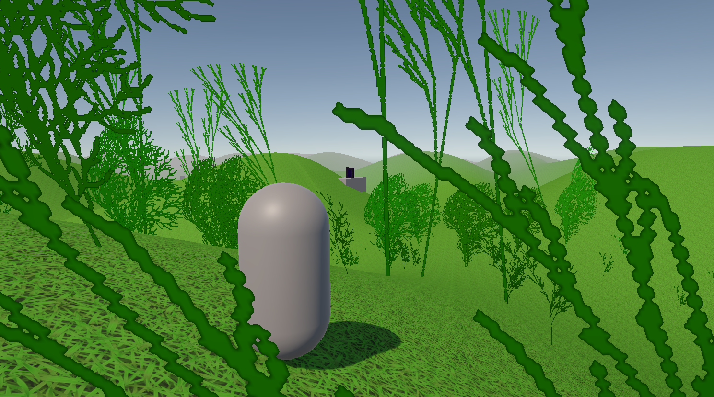

# 🏞️️ Procedural Generation
This is a Unity 6.0 project created for the Procedural Generation course. Its
primary goal is to demonstrate different procedural generation techniques,
which will all be explained in detail throughout the rest of the documentation.

In summary, these techniques include procedural generation of:
 * **Terrain**, using Simplex noise
 * **Vegetation**, using L-systems
 * **Dungeons**, using Cellular Automata
 * **NPCs and Items**, using regular randomization

<!-- Insert a gif of the game here -->

## 🌍 General
First and foremost, it is important to mention that the entire world generation
is consistent, given a seed. The seed, set in the Unity inspector, determines
the terrain's heightmap, the dungeon entrances' placement and their respective
dungeon's seed, which then determines the exact generation of the dungeon.
Vegetation varies based on the given seed, to make the world feel a bit more
dynamic.

## ⛰️ Terrain
As mentioned before, terrain generation uses Simplex noise as its base. The
seed determines a random offset in the Simplex noise map, which is then used
to sample positions for the heightmap. The terrain is divided into 64x64
chunks, to allow for infinite terrain generation and dynamic loading and
unloading.

### Heightmap Generation
TODO (I might change the terrain generation method, that's why I'm keeping
this for later)

### Chunk Loading
The chunk loading system uses a multi-threaded approach, in order to make the
gameplay feel smoother, and to make the loading as natural as possible.

When the game starts, there are no loaded chunks. In Awake(), a coroutine is
started, which runs every frame and checks for new chunks to be loaded. These
chunks are placed in a queue by a separate thread, whenever the data is ready
to be instantiated. At the beginning, the chunk queue is empty.

In the Update() method, the loader checks whether the player has moved to a new
chunk, and also runs on the first Update call. When this event occurs, the
following sequence of events takes place:
 * the *chunk generation task*, if it was previously running, is **cancelled**
 * the chunk creation queue is cleared, to avoid duplicating chunks
 * chunks that are too far away from the player are destroyed
   * a chunk is too far away is the Manhattan distance to the player is larger
     than the render distance
 * the chunk generation task is started on a separate thread

The parallel task has a single job: to create new chunks and to add them to the
queue when they are done. It goes through all the chunks within the render
distance, in a certain order: increasingly bigger diamond-shaped rings around
the player. A chunk is created only if it does not exist in a HashSet of loaded
chunks.

It is worth mentioning that Unity does not allow Unity-specific operations on
threads other than the main one, which led to the usage of a concurrent queue.
This is where the coroutine started in Awake comes into play: the generation
task simply created the terrain data for the chunk, as a float matrix. Each
frame, the coroutine checks for new chunks in the queue, takes the next one,
Instantiates the chunk, sets the terrain data, and populates the chunk with
details (vegetation).

The coroutine generates at most **one** chunk per frame, so as to not keep the
game frozen for too long.

### Biome Generation??

## 🌿 Vegetation
Vegetation, in short, is represented as detail layers in Unity's Terrain
functionality. They are billboarded textures, implicitly deformed by Unity
to create a wind effect. The important procedural generation functionality
uses L-systems to create the plant textures.

### Generation
The PlantGenerator MonoBehaviour provides an Inspector button (thanks to the
NaughtyAttributes package) that starts the texture generation of the selected
plants. Each plant is created as an L-system, with the following attributes:
 * **Start**, the starting symbol of the grammar
 * **Axioms**, a dictionary of rules that define the grammar
 * **N**, the maximum expansion depth of the grammar
 * **Forward Step**, the distance the cursor travels forward, in the virtual
   `[0, 1]` space, when an `F` symbol is met
 * **Angle Step**, the rotation step of the cursor's forward direction,
   whenever a `+` (anticlockwise) or `-` (clockwise) symbol is met

These attributes can be adjusted at will through the Inspector, with an added
texture name field for the file name of the future PNG. 

### Terrain Placement

## 🏰 Dungeons

### Entrance Placement

### Generation

## 🏹 NPCs and Items

### Generation

## Conclusion
